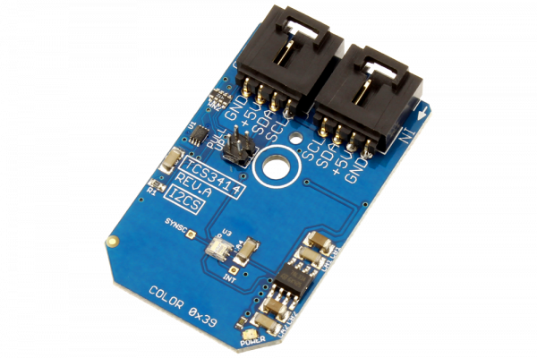

# TCS3414

The TCS3414 digital color light sensors are designed to accurately derive the color chromaticity and illuminance of ambient light and provide a digital output with 16-bits of resolution.It includes an 8 × 2 array of filtered photodiodes, analog-to-digital converters, and control functions on a single monolithic CMOS integrated circuit.
This Device is available from www.ncd.io 

[SKU: TCS3414_I2CS]

(https://store.ncd.io/product/tcs3414-16-bit-digital-color-sensor-programmable-analog-gain-i2c-mini-module/)
This Sample code can be used with Arduino.

Hardware needed to interface TCS3414 sensor with Arduino

1. <a href="https://store.ncd.io/product/i2c-shield-for-arduino-nano/">Arduino Nano</a>

2. <a href="https://store.ncd.io/product/i2c-shield-for-arduino-micro-with-i2c-expansion-port/">Arduino Micro</a>

3. <a href="https://store.ncd.io/product/i2c-shield-for-arduino-uno/">Arduino uno</a>

4. <a href="https://store.ncd.io/product/dual-i2c-shield-for-arduino-due-with-modular-communications-interface/">Arduino Due</a>

5. <a href="https://store.ncd.io/product/tcs3414-16-bit-digital-color-sensor-programmable-analog-gain-i2c-mini-module/">TCS3414 16Bit Digital Color Sensor</a>

6. <a href="https://store.ncd.io/product/i%C2%B2c-cable/">I2C Cable</a>

TCS3414:

The TCS3414 digital color light sensors are designed to accurately derive the color chromaticity and illuminance of ambient light and provide a digital output with 16-bits of resolution.It includes an 8 × 2 array of filtered photodiodes, analog-to-digital converters, and control functions on a single monolithic CMOS integrated circuit.

Applications:

• Temperature to White-Color Balance Displays Under Various Lighting Conditions.

• Coordinates to Manage DisplayBacklighting (i.e. RGB LED, CCFL, etc).

• Tablets, Laptops, Monitors and Medical Instrumentation.

How to Use the TCS3414 Arduino Library

The TCS3414 has a number of settings, which can be configured based on user requirements.
          
1.Integration mode:The following command is used to set the sensor free from integration mode.

            tcs.setIntegMode(INTEG_MODE_FREE);              // In this Mode, the Integrator is Free-Running and One of the Three Internally-Generated Nominal Integration Times is Selected for Each Conversion
            
 2.Integration time:The following command is used to set the integration time.
 
            tcs.setIntegParamTime(INTEG_PARAM_INTTIME_12MS);        // 12 ms
            
3.Gain setting:The following command is used to set the gain of sensor.

            tcs.setAnalogGain(GAIN_1X);                             // 1X
                 
4.Prescalar setting:The following command is used to set the prescalar.

            tcs.setPrescaler(PRESCALER_1);                          // Divide by 1     
